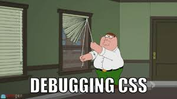
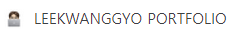

# 설 연휴 Web Portfolio 제작

LEEKWANGGYO HOMEPAGE : https://kwanggyo.github.io/My_Portfolio/

Google에서 kwanggyo portfolio 검색하면 볼 수 있다😮

<br>

### 02.08 < 구상 및 발표 >

- 어떻게 제작할 것인지 구상
  1.  ABOUT ME, SKILLS, CAREER & CERTIFICATION, CONTACT → navbar
  2.  사진 전시 → carousel
  3.   SKILLS → card, progress
  4.  CAREER & CERTIFICATION → card
  5.  CONTACT → icon, li
  6.  전체적인 Grid system
- 간단한 발표

<br>

### 02.09 ~ 02.10

- SWEA 알고리즘한테 혼나서 시작하지 못했다..
- 멘탈 케어,, 내일부터 연휴 시작~~

<br>

### 02.11 < 중간 점검 >

- 전체적인 틀 제작
- 디테일한 부분은 완성되지 않았지만 구상했었던 부분을 담았다.

:heavy_check_mark: Check

> - Grid system 구현 필요!

<br>

### 02.12 < 개인 작업 >

- 디테일한 부분을 맞추기 위해 style을 많이 조정했다.

- 특히, 정렬 되어있는 느낌을 주기위해 width, heigh 부분을 맞춰주는 것에 중점을 두었다.

  

  너무 공감되는 사진 ㅂㄷㅂㄷ

- 페이지 검사를 통해서 원하는 페이지를 만들었다~~

- 하지만, Grid system을 적용하면서 다시 문제 발생,,

  → 맞춰 놓은 부분들이 흩어지기 시작한다..다시 맞추기...

- CONTECT 부분을 제외하고 Grid system 구현!

:heavy_check_mark: Check

> - justify-content-center, align-items-center를 통해 중앙정렬을 잘 해둬야 Grid system을 적용할 때 흔들리지 않는다.
> - Grid system 적용시, row와 col의 위치를 잘 생각하고 시작하기!

<br>

### 02.13 < 개인 작업 >

- web 휴식 + 개인정비..ㅎㅎ 

  +오랜만에 백준 알고리즘를 푸는 시간을 가졌다.

<br>

### 02.14  <개인 작업, 최종 발표>

- card의 width를 조정하면서 줄어들은 progress 복구

- CONTECT 부분 Grid system 적용

- 웹 포트폴리오 팀원들 홈페이지 돌아보고 참고!

  - CONTECT 부분 간단하게 수정

  - image를 클릭하면 이동으로!

- 취미 부분도 추가적으로 만드려고 했지만..휴식의 끝은 없다ㅎ..

- 발표가 끝난 후에도 추가할 부분들 추가해나가기!

<br>

### README

- 마지막에 몰아서 작성하기😅
- 당일 작성이 필요하다..!

<br>

<br>

<br>

## 웹 페이지 만들기 SKILLS

<br>

### 1. 깃헙 페이지 만들기

- 새로운 repo 만들기
- settings 맨 아래부분 Branch: main → save
- 처음 페이지는 index.html로 해야한다.(보틍의 규칙, 이름 건들지 말기)
- 이 후에 만드는 것은 자유

<br>

### 2. SEO

: 검색엔진 최적화

- 검색하기에는 전 세계 페이지가 너무 많기 때문에
- 구글에서 원하는 방식으로 웹페이지를 만들면 앞쪽에 배치해준다고 함

<br>

### 3. metadata

: 데이터를 설명하는 데이터

- 우리가 쓴 코드가 무엇인지 설명해주는 데이터

- 이러한 데이터를 markup언어로 작성한 것 - 메이져에  따라 조금씩 다르다.

  ```html
  <meta property="og:type" content="website">
  <meta property="og:title" content="">
  <meta property="og:url" content="">
  <meta property="og:description" content="">
  <meta property="og:image:width" content="" />
  <meta property="og:image:height" content="" />
  <meta property="og:image" content="">
  
  ```

- 웹 사이트 런칭할 때 중요하다!
  - 썸네일을 통해 유저들이 신뢰하고 올 수 있게!!

<br>

### 4. OC(Open Graph)

: 캐시를 초기화 시켜준다.

- https://developers.kakao.com/tool/clear/og
- 캐시가 저장되어서 가져오기 때문에 파일을 수정하면 캐시를 지우고 다시 해야한다.

<br>

### 5. favicon



: 위의 창 앞쪽에 있는 이미지를 favicon이라고 한다.

- 구글에 favicon generator를 검색하여 들어간다.
- 만들 때 두가지의 선택지가 있는데
  - 잡다한 기기들에게 맞는 것으로 생성
  - Only 16 x 16 으로 생성(선택)
- 이미지를 올리고 만든 후 다운, 밑에 있는 경로를 html head 부분에 넣어주기

<br>

### 6. 구글에 홈페이지 올리는 방법

#### 1. Sitemap

- 페이지가 많아지는 경우에 구글 robot들이 다 확인하는데 힘들 수 있어서 알림판을 만들어준다.

- https://www.xml-sitemaps.com/ : 사이트를 만들어주는 사이트
- view site → view detail → download → git portfolio 리포에 올리기
- 페이지가 추가되면 xml 파일을 다시 바꿔서 넣어줘야한다. html 파일 수정은 상관 없다.

#### 2. Google search console

- google search console 검색
- 속성 → url 접두어 → html 태그 복사 → html head 부분에 붙여놓고 push
- 만든 사이트 뒤에 sitemap.xml을 넣어준다. → does not appear ~ 나오는 것이 정상!

<br>

### 7. Dittifund

- 우리가 정상적인 작업을 하는지 지켜보는..?

<br>

<br>

<br>

:memo: MEMO

> - 메인과 마스터 두개의 repo가 생성 되었을 경우
>   1. github repo 삭제
>   2. 로컬 폴더에서 중요한 부분들만 어디에 옮겨놓기
>   3. 로컬 폴더 삭제
>   4. 로컬 폴더 새로 만듦
>   5. 새로 만든 폴더에 2에서 빼 놓은 중요한 부분들을 옮겨놓기
>   6. git init > add > commit
>   7. github에 새로운 repo 만들기
>   8. git remote add origin ~~~
>   9. git push origin master
>   10. github page 생성
>
> <br>
>
> - 변수 사이트
>   - vscode beautify shortcut for windows